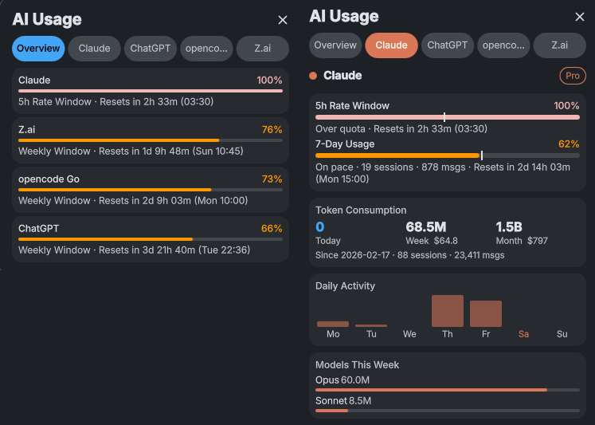

# AI Usage

A [DMS (Dank Material Shell)](https://github.com/AvengeMedia/DankMaterialShell) plugin that monitors your Claude, ChatGPT/Codex, Z.ai and opencode Go subscription usage directly from the taskbar. All four are optional and independently toggled. Install this for one, or any combination, and whichever aren't set up stay out of the way.

It is a fork of [dms-claudecode](https://github.com/titeya/dms-claudecode) by Nicolas Bellamy, which tracks Claude Code alone. See [Credits](#credits).



## Features

- **Taskbar pill** with a circular progress ring per enabled Source (Claude, ChatGPT, Z.ai, opencode Go), each showing its nearest-to-reset rate window
- **Pacing indicator** on every Source, showing whether you're over or under a linear burn rate for each window (e.g. "6% over pace", "25% under pace")
- **Detailed popout**, one tab per Source:
  - **Claude**: 5-hour and 7-day rate window utilization with countdown timers and pacing
  - **ChatGPT**: primary and secondary rate windows (lengths reported by the API) with countdown timers and pacing
  - **Z.ai**: 5-hour and weekly rate windows with countdown timers and pacing, plus weekly model-call count
  - **opencode Go**: 5-hour and weekly rate windows with countdown timers and pacing. The usage endpoint carries no plan name and no spend figures, so this tab shows no token, cost, chart or model breakdown
  - Token consumption breakdown for Claude, ChatGPT and Z.ai (today, calendar week, calendar month for Claude and ChatGPT; calendar week and month plus model-call count for Z.ai)
  - Weekly activity bar chart (Monday–Sunday) with interactive hover tooltips, for Claude, ChatGPT and Z.ai
  - Per-model token usage for the current calendar week, for Claude, ChatGPT and Z.ai
  - Estimated API cost per period (Claude only, automatic pricing from [LiteLLM](https://github.com/BerriAI/litellm) — no equivalent public price list exists for Codex/ChatGPT)
  - All-time session and message statistics (Claude)
- **Account breakdown**, per Source:
  - **Claude profiles** — a hybrid selector (tabs for up to 4, dropdown for more), discovered automatically from:
    - `~/.claude` (the `default` profile)
    - [CCS](https://github.com/kaitranntt/ccs) instances in `~/.ccs/instances/`
    - [claude-code-profiles](https://github.com/felipeadeildo/claude-code-profiles) profiles in `~/.ccp/profiles/*.env` (the `CLAUDE_CONFIG_DIR` declared in each `.env` is used)
    - Any directory you add manually under **Custom Profiles** in the plugin settings
  - **ChatGPT accounts** — any account you add manually under **Custom ChatGPT Accounts** in the plugin settings
  - **opencode Go accounts** — any account you add manually under **Custom opencode Accounts** in the plugin settings
  - Profile/account overlay on each Source's daily activity chart: grey bars show total usage, colored bars show the selected profile/account's share
- **Login action** when a Source's credentials are missing or expired — a card in that Source's popout starts `claude auth login --claudeai` (Claude) or a `codex` refresh (ChatGPT), then re-fetches on completion. API-key Sources (Z.ai, opencode Go) get a card pointing at the plugin settings instead
- **Graceful degradation**: a Source with no binary installed hides entirely; one with a missing/expired token or a rejected API key stays visible with a login card instead of silently showing zeros. opencode Go's undocumented endpoint adds a third state. When the endpoint fails rather than rejecting the key, the tab says so without sending you to settings, drops the ring from the pill, and marks the last known values as stale instead of showing them as current
- **Automatic subscription detection** via the Anthropic OAuth API (Claude) and the ChatGPT backend (Codex CLI's stored OAuth token)
- **Dynamic model pricing** — new Anthropic model families are detected automatically, no code changes needed
- **Currency support** — costs displayed in EUR for French locale, USD otherwise (exchange rate from ECB via [Frankfurter](https://www.frankfurter.app/))
- **Configurable refresh interval** (2 to 15 minutes)
- **Localization support** (English, French and Spanish)

## Requirements

- [DMS Shell](https://github.com/AvengeMedia/DankMaterialShell)
- [jq](https://jqlang.github.io/jq/) (JSON processor)

No Source is mandatory. Install and enable the ones you actually use:

- **Claude**: an active [Claude Code](https://docs.anthropic.com/en/docs/claude-code) installation with OAuth credentials
- **ChatGPT**: an active [Codex CLI](https://github.com/openai/codex) installation with OAuth credentials
- **Z.ai**: a [GLM Coding Plan](https://z.ai) API key — auto-detected from the pi coding agent config (`~/.pi/agent/models.json`) or the `ZAI_API_KEY` environment variable, or added under **Custom Z.ai Accounts**
- **opencode Go**: an opencode Go API key — auto-detected from the pi coding agent auth store (`~/.pi/agent/auth.json`), opencode's own credentials file (`~/.local/share/opencode/auth.json`), or the `OPENCODE_GO_KEY` / `OPENCODE_API_KEY` environment variables, or added under **Custom opencode Accounts**. The `opencode` binary itself is not required: this Source tracks a paid plan and works on a machine that only watches it

A Source with no binary on `PATH` or no discoverable credential is detected automatically and hidden from the pill/popout; it doesn't need to be disabled by hand.

## Installation

### From the DMS Plugin Registry

```
dms plugins install aiUsage
```

Or browse the plugin list in DMS Settings (`Mod + ,` > Plugins).

### Manual

Clone this repository into your DMS plugins directory:

```bash
git clone https://github.com/blind0wl/dms-ai-usage \
  ~/.config/DankMaterialShell/plugins/aiUsage
```

Then restart DMS.

## Configuration

Open DMS Settings (`Mod + ,` > Plugins > AI Usage) to adjust the refresh interval, toggle
pacing indicators, enable/disable each Source, and register custom profiles/accounts.

### Custom Claude Profiles

If you use a profile manager the plugin doesn't detect automatically, add it under
**Custom Profiles** with a name and a config directory path:

| Name | Config directory |
|------|------------------|
| `work` | `~/.ccp/data/work` |

The path is a `CLAUDE_CONFIG_DIR` — the folder that contains `projects/`, i.e. whatever
`~/.claude` is for the default profile. The plugin reads usage from `<path>/projects/`
and, when present, `<path>/.credentials.json` so rate limits are tracked per profile too.

Entries whose `projects/` folder doesn't exist are ignored, and a name already claimed by
an auto-detected profile is skipped.

### Custom ChatGPT Accounts

Add additional accounts under **Custom ChatGPT Accounts** the same way, with a name and an
auth directory (the folder containing `auth.json`, i.e. whatever `~/.codex` is by default).

### Custom Z.ai Accounts

Z.ai has no local config directory, so its accounts are registered by API key instead of by
path: add a name and a GLM Coding Plan key under **Custom Z.ai Accounts**.

| Name | API key |
|------|---------|
| `work` | `…` |

### Custom opencode Accounts

opencode Go is keyed the same way: add a name and an opencode Go API key under **Custom
opencode Accounts**. The default key is discovered from the pi coding agent auth store, then
opencode's own credentials file, then the environment, so an entry here is only needed when
that key lives somewhere else, or when you want to track more than one key.

## How It Works

The plugin runs four lightweight bash scripts on the configured refresh interval, one per
Source:

**Claude** (`get-claude-usage`):
1. Reads your OAuth token from `~/.claude/.credentials.json`
2. Queries the Anthropic usage API for current rate limit status
3. Scans `<config dir>/projects/` for every discovered profile (see above) for token consumption statistics — each profile is processed in parallel
4. Fetches model pricing from LiteLLM and USD/EUR exchange rate from ECB (cached daily in `~/.claude/pricing-cache.json`)

**ChatGPT** (`get-chatgpt-usage`):
1. Reads your OAuth token from `~/.codex/auth.json` (or a custom account's `auth.json`)
2. Queries the ChatGPT backend (`wham/usage`) for current rate limit status across the primary and secondary windows
3. Scans `<account dir>/sessions/**/*.jsonl` for every discovered account for token consumption statistics

**Z.ai** (`get-zai-usage`):
1. Reads your API key from `~/.pi/agent/models.json`, `ZAI_API_KEY`, or a custom account entry
2. Queries `api.z.ai`'s quota endpoint for the 5-hour and weekly window utilization
3. Queries the same host's model-usage endpoint for weekly/monthly tokens, model-call counts and the per-model breakdown — all server-side, so there's no binary to install and no local files are scanned. Hourly buckets returned by the API are treated as local dates when mapped onto the Monday–Sunday chart

**opencode Go** (`get-opencode-go-usage`):
1. Reads your API key from the pi coding agent auth store (`~/.pi/agent/auth.json`), opencode's own credentials file (`~/.local/share/opencode/auth.json`), `OPENCODE_GO_KEY` then `OPENCODE_API_KEY`, or a custom account entry
2. Queries opencode's undocumented Go usage endpoint for the account-level 5-hour (`rolling`) and weekly (`weekly`) window utilization and reset times. The response's `monthly` entry is returned but not shown, because the registry models two Windows. Window lengths are declared as 5 hours and 7 days, since the endpoint reports reset times rather than durations. There is no plan name and no spend in the response, so the tab carries only the Source name and the two Window cards

   The script keeps the endpoint's two failure modes apart. A 401 or 403, or a body carrying an `AuthError`, means the endpoint rejected the key. That reports missing credentials and shows the settings card, because the key is what you fix. Any other failure, whether a 404, a 5xx, a timeout or a body that does not carry the two Windows, reports the endpoint as unavailable. In that state the tab does not point at settings, the pill drops the Source's ring, and the tab says the endpoint could not be reached while marking its last known values as stale. On a first failure it shows no Window cards at all rather than a fabricated zero

The Claude and ChatGPT scripts detect whether their binary (`claude`/`codex`) is present
before doing any work, and the Z.ai and opencode Go scripts do the same with a discoverable
API key, so a Source with nothing set up short-circuits to "not installed" instead of
attempting a fetch.

Claude's usage API response is cached for 90 seconds (`~/.claude/usage-cache.json`) to
avoid rate limiting, with stale fallback on errors. ChatGPT's usage call has no cache —
it's a single lightweight request per account per refresh.

All data stays local. Network requests are limited to the official Anthropic API (usage),
the ChatGPT backend (usage), the Z.ai API (usage), the opencode Go usage endpoint, GitHub
(LiteLLM pricing, once/day), and Frankfurter (exchange rate, once/day).

## Credits

AI Usage began as a fork of [dms-claudecode](https://github.com/titeya/dms-claudecode) by
Nicolas Bellamy, which is a Claude Code usage monitor. This fork keeps that project's Claude
Source, its pacing and cost estimates, its profile handling and its settings and chart layout,
and adds the Source registry, the ChatGPT/Codex, Z.ai and opencode Go Sources, the Account model
and the generic login handling on top.

Both are MIT licensed, and the original copyright notice is preserved in [LICENSE](LICENSE).

## License

[MIT](LICENSE)
